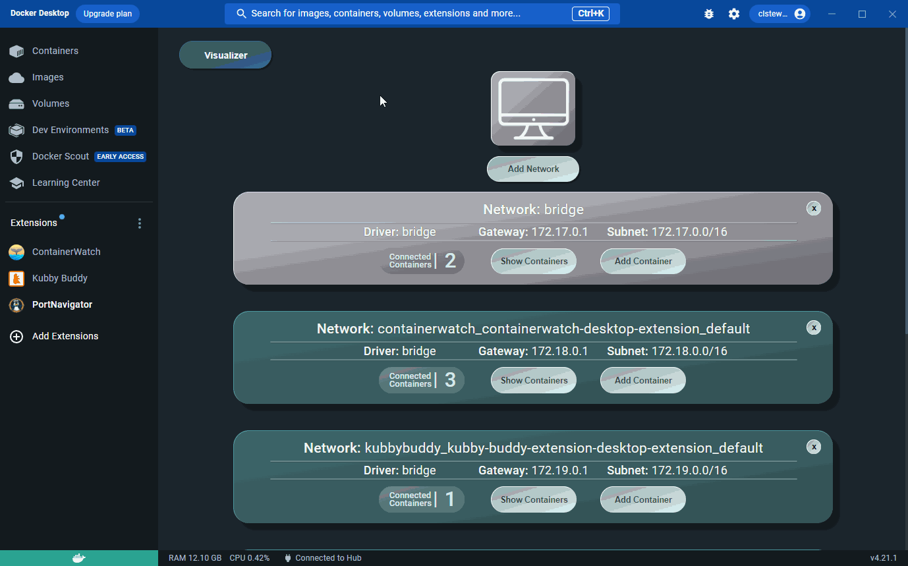
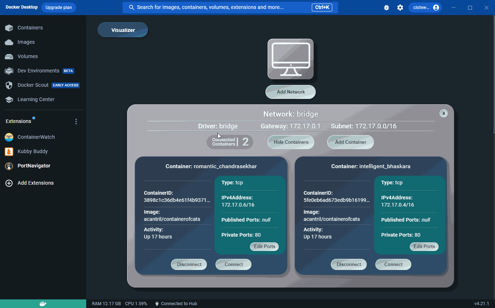

# PortNavigator

### A Docker Desktop Networking Tool

<!-- -------- Current README --------- -->
<br />
  <div align="center">
    
  </div>

<!-- -------- Table of Contents Section --------- -->

## Table of Contents

<ol>
      <br />
    <li><a href="#about-portnavigator">About PortNavigator</a></li>
    <li><a href="#features">Features</a></li>
    <li><a href="#installation-instructions">Installation</a></li>
    <li><a href="#contributing">Contributing</a></li> 
    <li><a href="#authors">Authors</a></li>
    <li><a href="#license">License</a></li>
  </ol>

<!-- -------- Product Description Section --------- -->

# About PortNavigator

<!-- Tired of struggling with complex Docker network configurations? Meet Port Navigator, your stress-free solution for effortlessly managing container
communication through our user-friendly GUI.

PortNavigator provides an instant snapshot of all available networks and their associated containers. Connecting and disconnecting containers from networks is as easy as a few clicks. Need a new network? With Port Navigator, network management tasks such as adding, deleting, and configuration are all simplified within our (extension? application?). No more relying on command line interactions, we've included everything you need to maintain your (network?container?) infrastructure efficiently.We also included a built-in visualization tool that provides a clear, bird's-eye view of your (container? netowrk? )ecosystem. -->

[![Docker][Docker]][Docker-url][![HTML5][HTML5]][HTML5-url][![CSS3][CSS3]][CSS3-url][![JavaScript][JavaScript]][JavaScript-url][![Typescript][Typescript]][Typescript-url][![React][React]][React-url][![React-Router][React-Router.js]][React-Router-url][![Nodejs][Nodejs]][Nodejs-url][![Webpack][Webpack]][Webpack-url][![Git][Git]][Git-url][![Github Actions][Github-Actions]][Github-Actions-url][![NPM][NPM]][NPM-url][![Jest][Jest]][Jest-url][![React-Testing-Library][React-Testing-Library]][React-Testing-Library-url][![Zustand][Zustand]][Zustand-url][![amCharts5][amCharts5]][amCharts5-url]

PortNavigator supports users with Docker networking configurations through a
Docker Desktop GUI that enables modification of gateways, subnets, IP addresses,
and container port mappings. The GUI also minimizes the need for command line
interactions and provides visualizations of existing networks and containers.

<div align="left">
  <!-- <a href="https://github.com/oslabs-beta/port-navigator">
    
  </a>
  <br /> -->
  <a href="https://PortNavigator.net/"><h3>https://PortNavigator.net/</h3></a>
<br/>
</div>

[![LinkedIn][linkedin-shield]][linkedin-url]

<!-- -------- Features --------- -->

<!--
<br />
  <div align="center">
    
  </div>
<br /> -->

# Features

### Container Networking Visuals

View your networks and their attached containers through the network management
GUI, or visualize your networks and containers in an Arc, Force, or Sankey
display.

<br />
  <div align="center">
    
  </div>
<br />

### Create & remove networks

Add user-created bridge networks for your containers directly from the user
interface and remove any unused networks.

<br />
  <div align="center">
    
  </div>
<br />

### Connect & disconnect containers to networks

Connect your containers to any default or user-created network configurations
and disconnect containers from any network.

<br />
  <div align="center">
    
  </div>
<br />

### Adjust port exposure

View published and private ports on containers and configure which ports are
published.

<br />
  <div align="center">
    
  </div>
<br />

# Installation Instructions

### Installation through the Docker Desktop Extension Marketplace (Recommended)

PortNavigator is a published extension of the Docker Desktop Extension
Marketplace. To install PortNavigator this way, you can

1. Install the
   <a href="https://www.docker.com/products/docker-desktop/"><span>Docker
   Destkop Client</span></a>
2. Click 'Add Extensions'
3. Use the search bar to search for 'PortNavigator'
4. Click the 'Install' button

### Installation through the command line

You can also install PortNavigator directly through the command line. To install
PortNavigator this way, you can

1. Fork and clone this repository
2. Install the
   <a href="https://www.docker.com/products/docker-desktop/"><span>Docker
   Destkop Client</span></a>
3. Build the extension image

```
docker build --tag=port-navigator/port-navigator:latest .
```

4. Install the extension

```
docker extension install port-navigator/port-navigator:latest
```

# Contributing

Contributing to an Open Source Product helps

If you would like to contribute, please follow the steps below, check out some
useful development commands and take a look at some of the features in
development:

1. Fork and Clone this Repository
2. Create a new Feature Branch

```
git checkout -b <Branch Name>
```

3. Commit and push your changes up to GitHub

```
git commit -m "<Your commit message>"
git push origin <Branch Name>
```

4. Create a pull request into the 'dev' branch of this Repository

## Features in Development

- IP address log
- Container port log
- Container page

## Useful Development Commands

### Update the extension

```
docker extension update port-navigator/port-navigator:latest
```

### Enable Chrome dev tools

```
docker extension dev debug port-navigator/port-navigator
```

### Enable hot reloading

1.  Navigating to the /ui folder

2.  Execute in command line

```
npm start
```

3.  In a separate terminal, execute in command line

```
docker extension dev ui-source port-navigator/port-navigator http://localhost:3000

```

# Authors

### Adrian Zywno

<div align="left">
    
  </div>

[![GitHub][GitHub-shield]](https://github.com/AdrianAdamZ)
[![LinkedIn][linkedin-shield]](https://www.linkedin.com/in/adrianadamz/)

### Brandon Gregoire

<div align="left">
    
  </div>

[![GitHub][GitHub-shield]](https://github.com/Bgregz)
[![LinkedIn][linkedin-shield]](https://www.linkedin.com/in/brandon-gregoire-942b88289/)

### Clayton Stewart

<div align="left">
    
  </div>

[![GitHub][GitHub-shield]](https://github.com/ClStewart1212)
[![LinkedIn][linkedin-shield]](https://www.linkedin.com/in/clstewart1212/)

### Wes Phipps

<div align="left">
    
  </div>

[![GitHub][GitHub-shield]](https://github.com/booksandgames)
[![LinkedIn][linkedin-shield]](www.linkedin.com/in/wp2890)

<!-- -------- License Information Section --------- -->

# License

This project is licensed under the terms of the [MIT LICENSE](LICENSE).

<!-- https://img.shields.io/badge/React.js-blue?style=plastic&logo=React&logoColor=pink&labelColor=%23475569 -->

[React]:
  https://img.shields.io/badge/React-20232A?style=for-the-badge&logo=react&logoColor=61DAFB
[React-url]: https://react.dev/learn
[React-Router.js]:
  https://img.shields.io/badge/React_Router-CA4245?style=for-the-badge&logo=react-router&logoColor=white
[React-Router-url]: https://reactrouter.com/en/main/start/overview
[Javascript]:
  https://img.shields.io/badge/JavaScript-323330?style=for-the-badge&logo=javascript&logoColor=F7DF1E
[Javascript-url]: https://www.javascript.com/
[Typescript]:
  https://img.shields.io/badge/typescript-%23007ACC.svg?style=for-the-badge&logo=typescript&logoColor=white
[Typescript-url]: https://www.typescriptlang.org/
[Docker]:
  https://img.shields.io/badge/docker-%230db7ed.svg?style=for-the-badge&logo=docker&logoColor=white
[Docker-url]: https://www.docker.com/
[React-Testing-Library]:
  https://img.shields.io/badge/React%20Testing%20Library-%23d97706?style=for-the-badge&logo=reacttestinglibrary&logoColor=white
[React-Testing-Library-url]:
  https://github.com/testing-library/react-testing-library
[Jest]:
  https://img.shields.io/badge/-jest-%23C21325?style=for-the-badge&logo=jest&logoColor=white
[Jest-url]: https://jestjs.io/docs/getting-started
[amCharts5]:
  https://img.shields.io/badge/amCharts_5-%23007ACC?style=for-the-badge&logo=data:image/svg+xml;base64,PD94bWwgdmVyc2lvbj0iMS4wIiBlbmNvZGluZz0iVVRGLTgiPz4KPHN2ZyB3aWR0aD0iNzVweCIgaGVpZ2h0PSIyMXB4IiB2aWV3Qm94PSIwIDAgNzUgMjEiIHZlcnNpb249IjEuMSIgeG1sbnM9Imh0dHA6Ly93d3cudzMub3JnLzIwMDAvc3ZnIiB4bWxuczp4bGluaz0iaHR0cDovL3d3dy53My5vcmcvMTk5OS94bGluayI+CiAgICA8IS0tIEdlbmVyYXRvcjogU2tldGNoIDUyLjQgKDY3Mzc4KSAtIGh0dHA6Ly93d3cuYm9oZW1pYW5jb2RpbmcuY29tL3NrZXRjaCAtLT4KICAgIDx0aXRsZT5sb2dvPC90aXRsZT4KICAgIDxkZXNjPkNyZWF0ZWQgd2l0aCBTa2V0Y2guPC9kZXNjPgogICAgPGcgaWQ9IjAzIiBzdHJva2U9Im5vbmUiIHN0cm9rZS13aWR0aD0iMSIgZmlsbD0ibm9uZSIgZmlsbC1ydWxlPSJldmVub2RkIiBzdHJva2UtbGluZWNhcD0icm91bmQiIHN0cm9rZS1saW5lam9pbj0icm91bmQiPgogICAgICAgIDxnIGlkPSIwMSIgdHJhbnNmb3JtPSJ0cmFuc2xhdGUoLTE4My4wMDAwMDAsIC0xNC4wMDAwMDApIiBzdHJva2Utd2lkdGg9IjIiPgogICAgICAgICAgICA8ZyBpZD0iSGVhZGVyIj4KICAgICAgICAgICAgICAgIDxnIGlkPSJsb2dvIiB0cmFuc2Zvcm09InRyYW5zbGF0ZSgxODQuMDAwMDAwLCAxNS4wMDAwMDApIj4KICAgICAgICAgICAgICAgICAgICA8ZyBpZD0iYW1Mb2dvIj4KICAgICAgICAgICAgICAgICAgICAgICAgPHBhdGggZD0iTTcxLjYyMjY0MTUsMTkgTDQ1Ljk0MDI0NDIsMTkgQzMyLjQ1NDk5NDksMTguOTYzOTAxIDM0LjY0NDc5ODQsMCAyNC4wODEyNDQ1LDAgQzEzLjUxNzY5MDcsMCAxNS43MDc4MjQ4LDE4Ljk2MzkwMSAyLjM1Nzk5NDA5LDE5IEwtOC41NjU5MDI3NWUtMTQsMTkiIGlkPSJTdHJva2UtMSIgc3Ryb2tlPSIjNUVCMEZDIj48L3BhdGg+CiAgICAgICAgICAgICAgICAgICAgICAgIDxwYXRoIGQ9Ik0wLDE5IEwyMS43NDQ2ODA5LDE5IEMyNS40MTcyNjIzLDE4Ljk3OTYzODggMjguMjk0ODI5MiwxOC4wNzI3NDI0IDMwLjkwMjA5MTgsMTQuOTM4NDI0NSBDMzIuMzk2MzEwOCwxMy4xNDIyMDE2IDMzLjcxMzkxMzEsMTEuMTYyMzk5IDM0Ljc2MzkwMDgsOS4wMTc0MDc2NyBDMzUuNjAzMDU0MSw3LjMwMjk1ODExIDM2LjA3MDc0NDcsNS4zMTU0MzggMzcuMTc1NTcwMiwzLjc2ODQ3NjEgQzM4LjAzNDQ0NzIsMi41NjU4NDkwOSAzOS45OTg0NDg2LDIuMzMwMDUyNzUgNDEuMDM0MDkxOCwzLjM3NzUwNzM4IEM0Mi43MjA0NjczLDUuMDgzNDE4MzUgNDMuMzMyOTQ3NywxMS4wODUyMjMzIDQ2LjA1MjcyNSwxMS4yNzk4MDQ2IEM0OC42MzQyODcxLDExLjQ2NDY5NzggNDkuMzg4NDE5NSw1LjUyMDY5MjQ4IDUwLjg5MTMwNDksMy43NzcxNzg4OCBDNTMuNjA2MTUxMywwLjYyODkwMzY4MiA1Ni4xMDY4NzYyLDQuMTI0MTQxMDUgNTcuMjAwMzQ1Niw2Ljg5MDMxNDUyIEM1OS42MTQxMDY5LDEyLjk5NjM4ODggNjMuODYwMjI5LDE4Ljk5OTgzNTggNzAuNjcwMjEyOCwxOC45OTk4MzU4IEw3MywxOC45OTk4MzY2IiBpZD0iUGFnZS0xIiBzdHJva2U9IiNGRkZGRkYiPjwvcGF0aD4KICAgICAgICAgICAgICAgICAgICAgICAgPHBhdGggZD0iTTIzLjQxNTA5NDMsMCBDMTMuMTY0NDMzNCwwIDE1LjI4OTU1MDksMTkuMDYxMzgxOSAyLjI2MzI1NTMxLDE4Ljk5OTg1MTQgTDEuMjQzNDQ5NzllLTEzLDE4Ljk5OTg1MTQiIGlkPSJTdHJva2UtMyIgc3Ryb2tlPSIjNUVCMEZDIj48L3BhdGg+CiAgICAgICAgICAgICAgICAgICAgPC9nPgogICAgICAgICAgICAgICAgPC9nPgogICAgICAgICAgICA8L2c+CiAgICAgICAgPC9nPgogICAgPC9nPgo8L3N2Zz4=
[amCharts5-url]: https://www.amcharts.com/docs/v5/
[NPM]:
  https://img.shields.io/badge/npm-CB3837?style=for-the-badge&logo=npm&logoColor=white
[NPM-url]: https://docs.npmjs.com/about-npm
[Webpack]:
  https://img.shields.io/badge/Webpack-%2364748b?style=for-the-badge&logo=Webpack
[Webpack-url]: https://webpack.js.org/
[Github-Actions]:
  https://img.shields.io/badge/GithubActions-%23581c87?style=for-the-badge&logo=GithubActions&color=gray
[Github-Actions-url]: https://docs.github.com/en/actions
[Zustand]:
  https://img.shields.io/badge/Zustand-%2378716c?style=for-the-badge&logo=data:image/svg+xml;base64,PD94bWwgdmVyc2lvbj0iMS4wIiBzdGFuZGFsb25lPSJubyI/Pgo8IURPQ1RZUEUgc3ZnIFBVQkxJQyAiLS8vVzNDLy9EVEQgU1ZHIDIwMDEwOTA0Ly9FTiIKICJodHRwOi8vd3d3LnczLm9yZy9UUi8yMDAxL1JFQy1TVkctMjAwMTA5MDQvRFREL3N2ZzEwLmR0ZCI+CjxzdmcgdmVyc2lvbj0iMS4wIiB4bWxucz0iaHR0cDovL3d3dy53My5vcmcvMjAwMC9zdmciCiB3aWR0aD0iNDguMDAwMDAwcHQiIGhlaWdodD0iNDguMDAwMDAwcHQiIHZpZXdCb3g9IjAgMCA0OC4wMDAwMDAgNDguMDAwMDAwIgogcHJlc2VydmVBc3BlY3RSYXRpbz0ieE1pZFlNaWQgbWVldCI+CjxtZXRhZGF0YT4KQ3JlYXRlZCBieSBwb3RyYWNlIDEuMTAsIHdyaXR0ZW4gYnkgUGV0ZXIgU2VsaW5nZXIgMjAwMS0yMDExCjwvbWV0YWRhdGE+CjxnIHRyYW5zZm9ybT0idHJhbnNsYXRlKDAuMDAwMDAwLDQ4LjAwMDAwMCkgc2NhbGUoMC4xMDAwMDAsLTAuMTAwMDAwKSIKZmlsbD0iIzAwMDAwMCIgc3Ryb2tlPSJub25lIj4KPHBhdGggZD0iTTE2OSAzMjMgYy03OCAtNzQgLTc4IC05MyAtMyAtMTY3IDMwIC0zMSA2NCAtNTYgNzQgLTU2IDEwIDAgNDQgMjUKNzQgNTYgbDU2IDU1IDAgNjQgYzAgNTcgLTMgNjYgLTI2IDg0IC0xOCAxNCAtNDEgMjEgLTcxIDIxIC00MCAwIC01MCAtNSAtMTA0Ci01N3ogbTE3MSAtNDggbDAgLTY1IC0zMCAwIGMtMjggMCAtMzAgMyAtMzAgMzUgMCAzMyAtMiAzNSAtMzUgMzUgLTMyIDAgLTM1CjIgLTM1IDMwIGwwIDMwIDY1IDAgNjUgMCAwIC02NXogbS0xNDAgLTM1IGMwIC0yNyAtMyAtMzAgLTMwIC0zMCAtMjcgMCAtMzAgMwotMzAgMzAgMCAyNyAzIDMwIDMwIDMwIDI3IDAgMzAgLTMgMzAgLTMweiBtNzAgMCBjMCAtMjcgLTMgLTMwIC0zMCAtMzAgLTI3IDAKLTMwIDMgLTMwIDMwIDAgMjcgMyAzMCAzMCAzMCAyNyAwIDMwIC0zIDMwIC0zMHogbTAgLTcwIGMwIC0yNyAtMyAtMzAgLTMwCi0zMCAtMjcgMCAtMzAgMyAtMzAgMzAgMCAyNyAzIDMwIDMwIDMwIDI3IDAgMzAgLTMgMzAgLTMweiIvPgo8L2c+Cjwvc3ZnPgo=
[Zustand-url]: https://www.npmjs.com/package/zustand
[Nodejs]:
  https://img.shields.io/badge/node.js-6DA55F?style=for-the-badge&logo=node.js&logoColor=white
[Nodejs-url]: https://nodejs.org/en/docs
[linkedin-shield]:
  https://img.shields.io/badge/-LinkedIn-black.svg?style=for-the-badge&logo=linkedin&colorB=555
[linkedin-url]: https://www.linkedin.com/company/portnavigator
[Git]:
  https://img.shields.io/badge/git-%23F05033.svg?style=for-the-badge&logo=git&logoColor=white
[Git-url]: https://git-scm.com/
[CSS3]:
  https://img.shields.io/badge/css3-%231572B6.svg?style=for-the-badge&logo=css3&logoColor=white
[CSS3-url]: https://www.w3schools.com/css/
[HTML5]:
  https://img.shields.io/badge/html5-%23E34F26.svg?style=for-the-badge&logo=html5&logoColor=white
[HTML5-url]: https://www.w3schools.com/html/
[PortNavigator]:
  https://img.shields.io/badge/PortNavigator-blue.svg?style=for-the-badge
[Port-url]: https://www.w3schools.com/html/
[GitHub-shield]:
  https://img.shields.io/badge/github-%23F05033.svg?style=for-the-badge&logo=github&logoColor=white
[GitHub-url]: https://git-scm.com/
