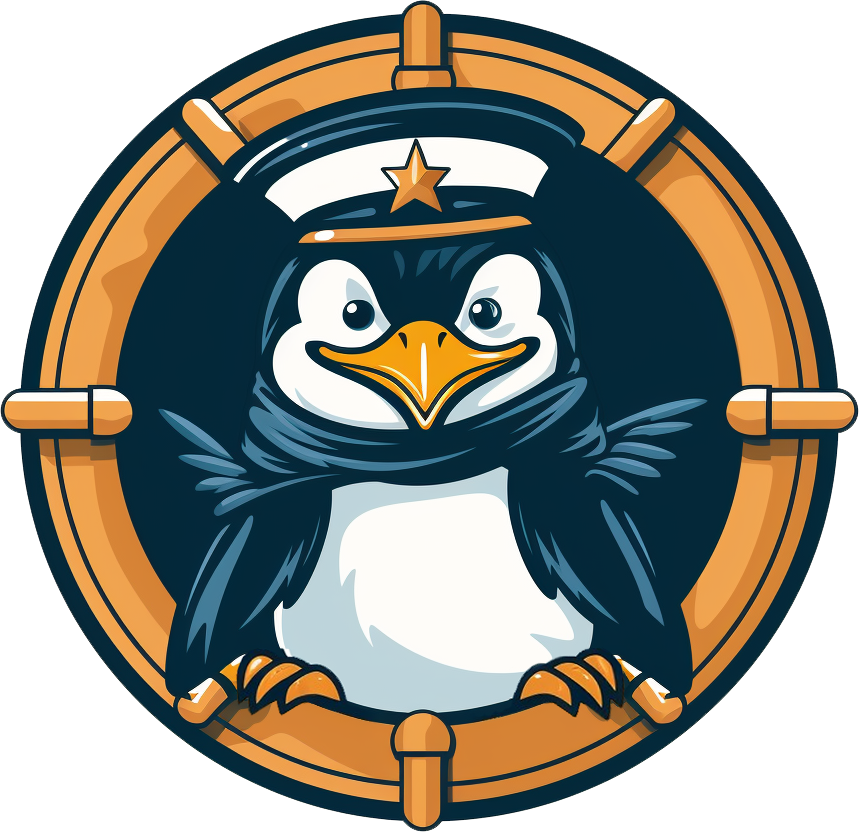

<!-- -------- Current README --------- -->

# PortNavigator

<br />
<div align="center">
  <a href="https://github.com/oslabs-beta/port-navigator">
    
  </a>
  <br />
  <a href="https://PortNavigator.net/">Website</a>
<br/>
A Docker networking management and visualization tool to configure and maintain Docker container network settings.
</div>

<!-- -------- Table of Contents Section --------- -->

<!-- TODO: Will need to link section names by clicking on them on GitHub here -->

# Table of Contents

<ol>
      <br />
    <li><a href="#about-portnavigator">About PortNavigator</a></li>
    <li><a href="#features">Features</a></li>
    <li><a href="#installation-instructions">Installation</a></li>
    <li><a href="#contributing">Contributing</a></li> 
    <li><a href="#authors">Authors</a></li>
    <li><a href="#license">License</a></li>
  </ol>

<!-- -------- Product Description Section --------- -->

# About PortNavigator

Tired of struggling with complex Docker network configurations? Meet Port Navigator, your stress-free solution for effortlessly managing container
communication through our user-friendly GUI.

Upon installation, our (extension? application?) provides an instant snapshot of all available networks and their associated containers. Connecting and disconnecting containers from networks is as easy as a few clicks. Need a new network? With Port Navigator, network management tasks such as adding, deleting, and configuration are all simplified within our (extension? application?). No more relying on command line interactions, we've included everything you need to maintain your (network?container?) infrastructure efficiently.We also included a built-in visualization tool that provides a clear, bird's-eye view of your (container? netowrk? )ecosystem.

<!-- Possible revision to a more formal tone? -->

Port Navigator is a Docker Desktop extension for container networking. Using PortNavigator, you can add user-created bridge networks, delete networks, connect/disconnect containers, and manage ports directly through the user interface. We also use amcharts to provide the ability to visualize networks and containers.

<div>
[![Docker][Docker]][Docker-url][![Typescript][Typescript]][Typescript-url][![JavaScript][JavaScript]][JavaScript-url][![React][React.js]][React-url][![Node][Node.js]][Node-url][![Jest][Jest]][Jest-url][![Webpack][Webpack]][Webpack-url][![Github Actions][Github-Actions]][Github-Actions-url][![Zustand][Zustand]][Zustand-url][![NPM][NPM]][NPM-url][![amCharts5][amCharts5]][amCHarts5-url][![React-Testing-Library][React-Testing-Library]][React-Testing-Library-url]

</div>

<!-- -------- Features --------- -->

<!--
<br />
  <div align="center">
    
  </div>
<br /> -->

# Features

### Container Networking Visuals

View your networks and their attached containers through the network management GUI, or visualize your networks and containers in an Arc or Sankey display.

<!-- TODO: Add a screenshot here of networks page and both visualizer options -->

### Create new networks

Add user-created bridge networks for your containers directly from the user interface.

<!-- TODO: Add a screenshot of add network form here -->

### Connect containers to networks

Connect your containers to the default bridge network, the default host network, or your user-created bridge networks.

<!-- TODO:  Add screenshots of add container and connect container forms here -->

### View disconnected containers

Identify which containers are not currently connected to a network.

<!-- TODO:  Add a screenshot of the none network here -->

### Adjust port exposures

View published and private ports on containers and adjust which ports are published.

<!-- TODO:  Add screenshot of ports form -->

<!-- -------- Instructions Section --------- -->

# Installation Instructions

<!-- There are two ways to install PortNavigator, both of which are explained below. -->

### Installation through the Docker Desktop Extension Marketplace (Recommended)

PortNavigator is a published extension of the Docker Desktop Extension Marketplace. To install PortNavigator this way, you can

1. Install the <a href="https://www.docker.com/products/docker-desktop/"><span>Docker Destkop Client</span></a>
2. Click 'Add Extensions'
3. Use the search bar to search for 'PortNavigator'
4. Click the 'Install' button

### Installation through the command line

You can also install PortNavigator directly through the command line. To install PortNavigator this way, you can

1. Fork and clone this repository
2. Install the <a href="https://www.docker.com/products/docker-desktop/"><span>Docker Destkop Client</span></a>
3. Build the extension image

<!-- TO DO:  change the commands to not include ctri17g? -->

```
docker build --tag=ctri17g/port-navigator:latest .
```

4. Install the extension
<!-- TO DO:  change the commands to not include ctri17g? -->

```
docker extension install ctri17g/port-navigator:latest
```

# Contributing

Contributing to an Open Source Product helps

If you would like to contribute, please follow the steps below, check out some useful development commands and take a look at some of the features in development:

1. Fork and Clone this Repository
2. Create a new Feature Branch

```
git checkout -b <Branch Name>
```

3. Commit and push your changes up to GitHub

```
git commit -m "<Your commit message>"
git push origin <Branch Name>
```

4. Create a pull request into the 'dev' branch of this Repository

## Features in Development

- IP address log
- Container port log
- Container page

## Useful Development Commands

### Update the extension

<!-- TO DO:  change the commands to not include ctri17g? -->

```
docker extension update ctri17g/port-navigator:latest
```

### Enable Chrome dev tools

<!-- TO DO:  change the commands to not include ctri17g? -->

```
docker extension dev debug ctri17g/port-navigator
```

### Enable hot reloading

1.  Navigating to the /ui folder

2.  Execute in command line

```
npm start
```

3.  In a separate terminal, execute in command line
<!-- TO DO:  change the commands to not include ctri17g? -->

```
docker extension dev ui-source ctri17g/port-navigator http://localhost:3000

```

<!-- -------- Open Source Information Section --------- -->

<!-- -------- Contributor Information Section --------- -->

# Authors

<!-- TODO:  Still need to add some LinkedIns -->

Adrian Zywno 
[GitHub](https://github.com/AdrianAdamZ) |
[LinkedIn](https://www.linkedin.com/in/adrianadamz/)

Brandon Gregiore 
[GitHub](https://github.com/Bgregz) |
[LinkedIn](add your link to your LinkedIn profile here)

Clayton Stewart 
[GitHub](https://github.com/ClStewart1212) |
[LinkedIn](https://www.linkedin.com/in/clstewart1212/)

Wes Phipps 
[GitHub](https://github.com/booksandgames) |
[LinkedIn](add your link to your LinkedIn profile here)

<!-- -------- License Information Section --------- -->

# License

This project is licensed under the terms of the MIT LICENSE.

<!-- -------- Previous README --------- -->

<!-- # port-navigator

CTRI-G Docker Desktop Extension (Adrian, Brandon, Clayton, Wes)

## To build the extension image

docker build --tag=ctri17g/port-navigator:latest .

## To install the extension

docker extension install ctri17g/port-navigator:latest

## To update the extension

docker extension update ctri17g/port-navigator:latest

## Enable front-end debug mode

docker extension dev debug ctri17g/port-navigator

## Hot reloading

1. navigate to ui folder
2. npm start
3. While server is running, in a separate termianal run:

docker extension dev ui-source ctri17g/port-navigator http://localhost:3000

## Disable debug mode, hot reloading, etc.

docker extension dev reset ctri17g/port-navigator

# CLI commands to know

- prune networks: Remove all unused networks ?
  https://docs.docker.com/engine/reference/commandline/network_prune/ docker
  network prune [OPTIONS] --filter Provide filter values (e.g.
  until=<timestamp>) --force , -f Do not prompt for confirmation

# create a new network

? https://docs.docker.com/engine/reference/commandline/network_create/ docker
network create [OPTIONS] <network name> _--attachable Enable manual container
attachment --aux-address Auxiliary IPv4 or IPv6 addresses used by Network driver
?--config-from The network from which to copy the configuration ?--config-only
Create a configuration only network --driver , -d bridge Driver to manage the
Network _--gateway IPv4 or IPv6 Gateway for the master subnet --ingress Create
swarm routing-mesh network --internal Restrict external access to the network
_--ip-range Allocate container ip from a sub-range --ipam-driver IP Address
Management Driver ?--ipam-opt Set IPAM driver specific options --ipv6 Enable
IPv6 networking ?--label Set metadata on a network --opt , -o Set driver
specific options _--scope Control the network’s scope \*--subnet Subnet in CIDR
format that represents a network segment

## remove a network

? https://docs.docker.com/engine/reference/commandline/network_rm/ docker
network rm <network name>

## connect a container to a network

? https://docs.docker.com/engine/reference/commandline/network_connect/ docker
network connect [OPTIONS] <network name> <container name> _--alias Add
network-scoped alias for the container ?--driver-opt driver options for the
network _--ip IPv4 address (e.g., 172.30.100.104) --ip6 IPv6 address (e.g.,
2001:db8::33) --link Add link to another container --link-local-ip Add a
link-local address for the container

## disconnect a container from a network

? https://docs.docker.com/engine/reference/commandline/network_disconnect/
docker network disconnect [OPTIONS] <network name> <container name> --force , -f
Force the container to disconnect from a network

## run a container

? https://docs.docker.com/engine/reference/commandline/run/ docker run [OPTIONS]
IMAGE [COMMAND] [ARG...] --expose Expose a port or a range of ports --ip IPv4
address (e.g., 172.30.100.104) specify an ip address for the container you are
connecting to --ip6 IPv6 address (e.g., 2001:db8::33) --name Assign a name to
the container --network Connect a container to a network --network-alias Add
network-scoped alias for the container --publish , -p Publish a container’s
port(s) to the host publish and allow connection to host -->

[React.js]: https://img.shields.io/badge/React.js-blue
[React-url]: https://react.dev/learn
[Javascript]: https://img.shields.io/badge/Javascript-991b1b
[Javascript-url]: https://www.javascript.com/
[Typescript]: https://img.shields.io/badge/Typescript-%23fde68a
[Typescript-url]: https://www.typescriptlang.org/
[Docker]: https://img.shields.io/badge/Docker-%236d28d9
[Docker-url]: https://www.docker.com/
[React-Testing-Library]: https://img.shields.io/badge/ReactTestingLibrary-%23b45309
[React-Testing-Library-url]: https://github.com/testing-library/react-testing-library
[Jest]: https://img.shields.io/badge/Jest-%2322d3ee
[Jest-url]: https://jestjs.io/docs/getting-started
[amCharts5]: https://img.shields.io/badge/amCharts5-%23f472b6
[amCharts5-url]: https://www.amcharts.com/docs/v5/
[NPM]: https://img.shields.io/badge/NPM-%233f6212
[NPM-url]: https://docs.npmjs.com/about-npm
[Webpack]: https://img.shields.io/badge/Webpack-%23374151
[Webpack-url]: https://webpack.js.org/
[Github-Actions]: https://img.shields.io/badge/GithubActions-%2386198f
[Github-Actions-url]: https://docs.github.com/en/actions
[Zustand]: https://img.shields.io/badge/Zustand-%2371717a
[Zustand-url]: https://www.npmjs.com/package/zustand
[Nodejs]: https://img.shields.io/badge/Nodejs-%23fed7aa
[Nodejs-url]: https://nodejs.org/en/docs
